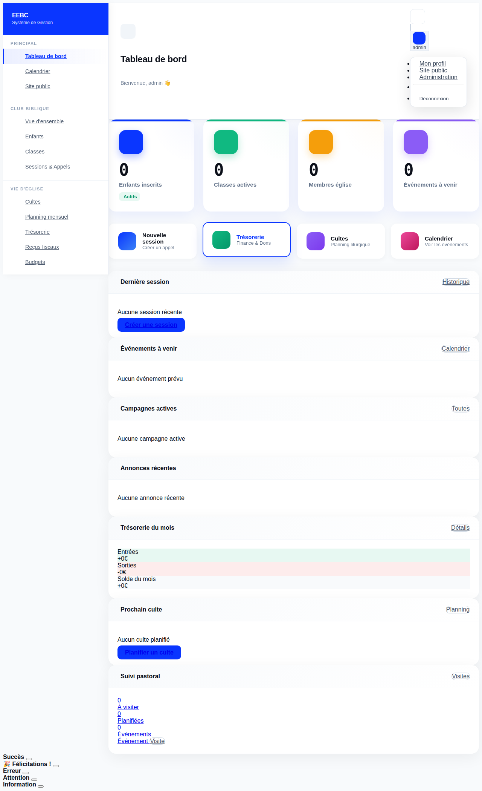
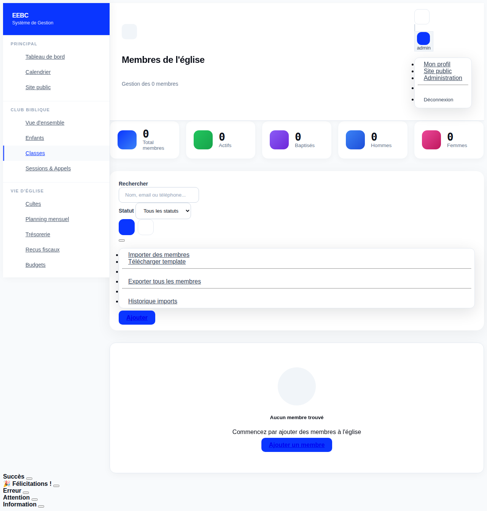
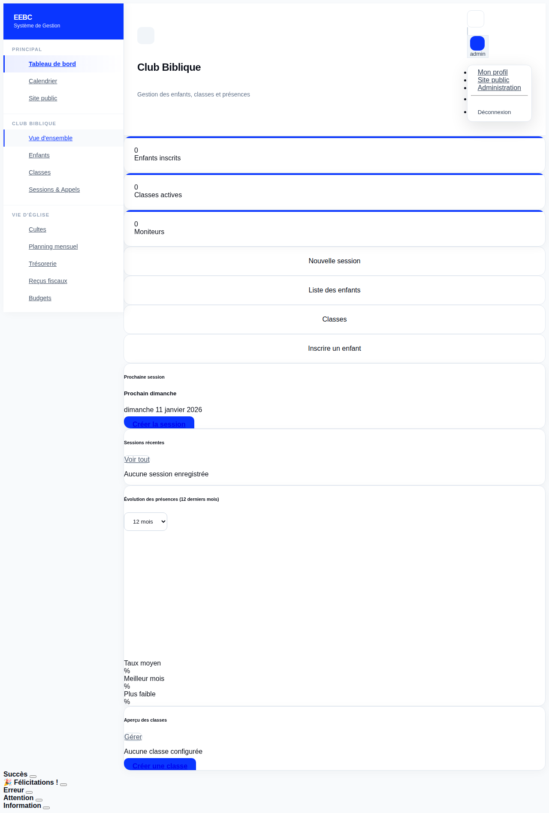
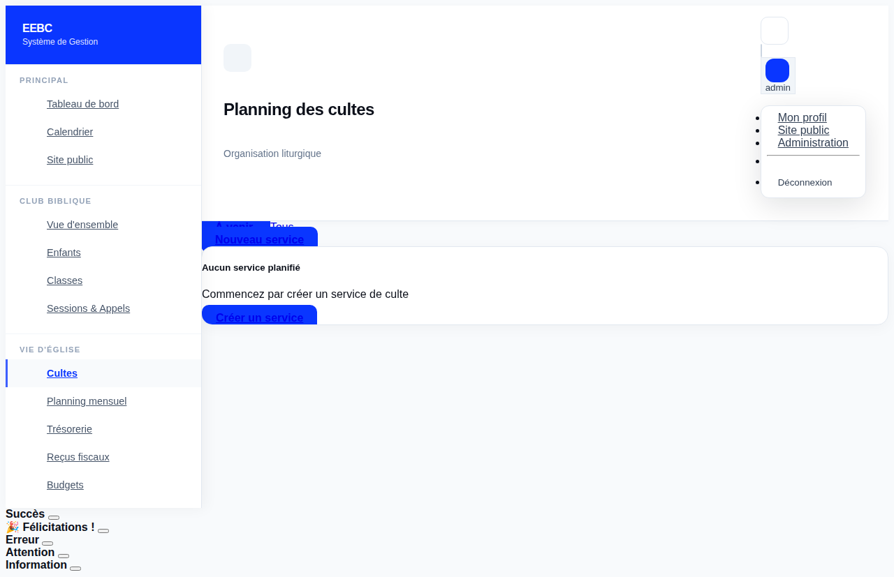
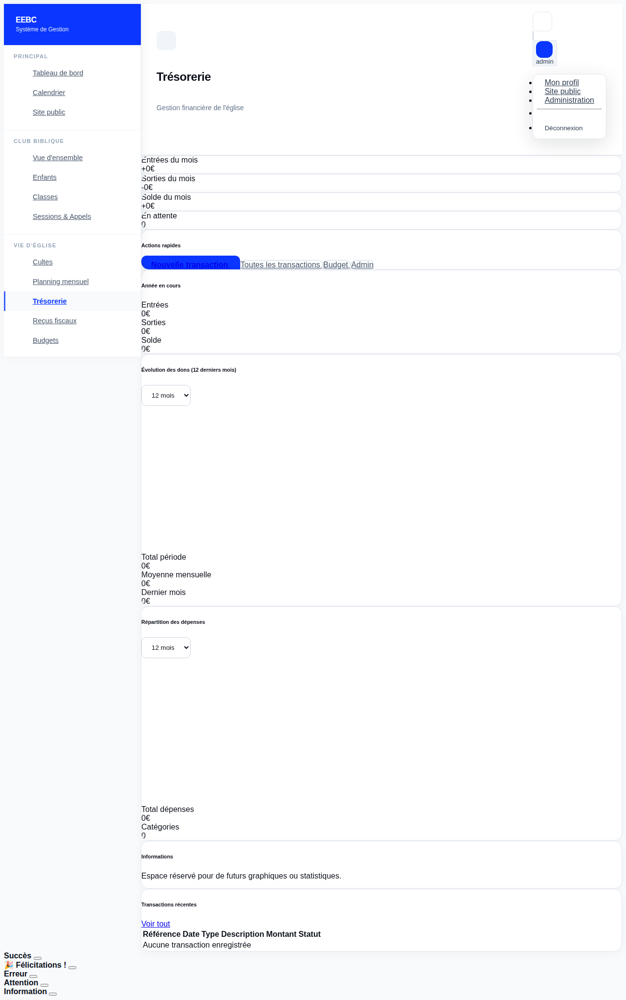
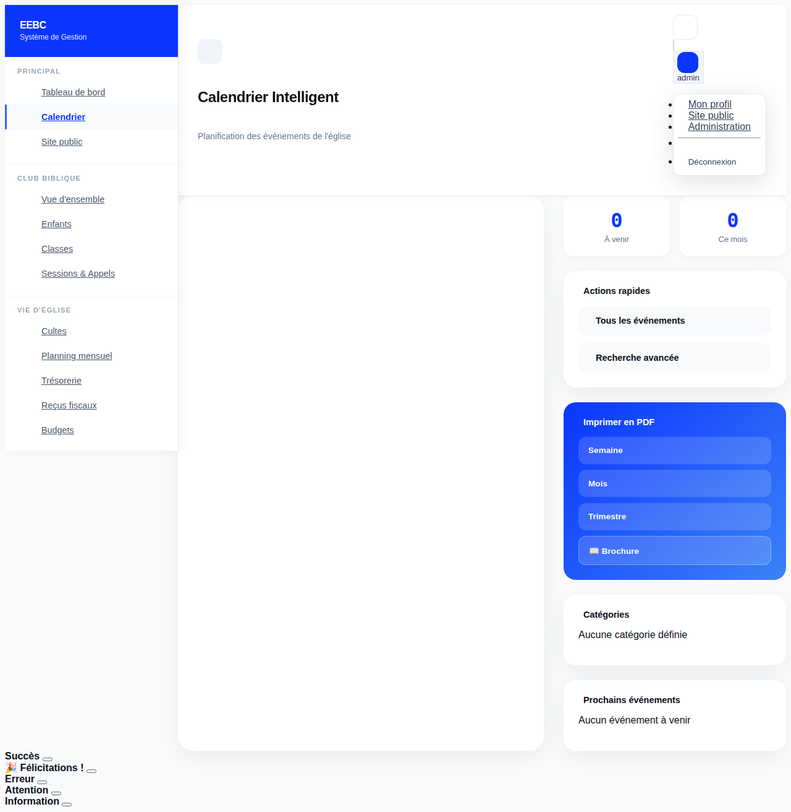
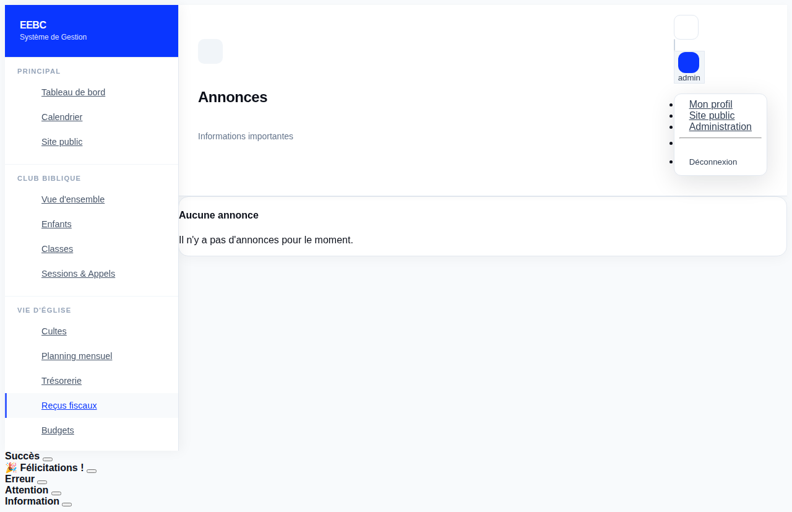

# Guide Utilisateur Complet - Gestion EEBC

**Application de gestion pour l'Église Évangélique Baptiste de Cabassou**

Version 1.1 | Janvier 2026

---

## Table des matières

1. [Introduction](#1-introduction)
2. [Connexion et Navigation](#2-connexion-et-navigation)
3. [Module Membres](#3-module-membres)
4. [Module Club Biblique](#4-module-club-biblique)
5. [Module Cultes (Worship)](#5-module-cultes-worship)
6. [Module Finance](#6-module-finance)
7. [Module Événements](#7-module-événements)
8. [Module Groupes](#8-module-groupes)
9. [Module Départements](#9-module-départements)
10. [Module Transport](#10-module-transport)
11. [Module Inventaire](#11-module-inventaire)
12. [Module Communication](#12-module-communication)
13. [Conseils et Bonnes Pratiques](#13-conseils-et-bonnes-pratiques)
14. [Annexes](#14-annexes)

---

## 1. Introduction

### 1.1 Présentation de l'application

L'application Gestion EEBC est un système complet de gestion d'église conçu spécifiquement pour l'Église Évangélique Baptiste de Cabassou. Cette solution moderne et intuitive permet de :

- **Gérer les membres** et leur suivi pastoral avec CRM intégré
- **Organiser le club biblique** des enfants avec suivi des présences
- **Planifier les cultes** et services avec assignation automatique des rôles
- **Suivre les finances** (dons, dîmes, dépenses) avec tableaux de bord
- **Coordonner les événements** et activités avec calendrier intelligent
- **Gérer les groupes** et départements de l'église
- **Organiser le transport** des fidèles et des enfants
- **Inventorier le matériel** de l'église
- **Communiquer** avec les membres (emails, SMS, annonces)

**Avantages clés :**
- Interface moderne et intuitive
- Accessible depuis n'importe quel appareil (ordinateur, tablette, smartphone)
- Données sécurisées et sauvegardées
- Rapports et statistiques en temps réel
- Automatisation des tâches répétitives
- Mode sombre pour confort visuel

### 1.2 Architecture multi-sites

L'application supporte plusieurs sites d'église :
- **Cabassou** (site principal) - ID membre : `EEBC-CAB-XXXX`
- **Macouria** - ID membre : `EEBC-MAC-XXXX`

Chaque membre, événement, transaction peut être associé à un site spécifique.


---

## 2. Connexion et Navigation

### 2.1 Accès à l'application

- **URL publique** : https://gestion-eebc.onrender.com
- **URL locale** (développement) : http://localhost:8000

### 2.2 Connexion


1. Accédez à la page de connexion
2. Entrez votre nom d'utilisateur et mot de passe
3. Cliquez sur "Se connecter"

**Sécurité :**
- Les mots de passe sont cryptés
- Session automatiquement fermée après 30 minutes d'inactivité
- Possibilité d'activer l'authentification à deux facteurs (2FA)

### 2.3 Interface principale



L'interface se compose de :
- **Barre supérieure** : Logo, recherche, notifications, profil utilisateur, mode nuit
- **Menu latéral (sidebar)** : Navigation vers tous les modules organisés par catégories
  - **Principal** : Tableau de bord, Calendrier, Site public
  - **Club Biblique** : Vue d'ensemble, Enfants, Classes, Sessions
  - **Vie d'Église** : Cultes, Planning mensuel, Trésorerie, Reçus fiscaux, Budgets, Campagnes
  - **Gestion** : Membres, Familles, Événements de vie, Visites pastorales, Groupes, Départements
  - **Ressources** : Transport, Inventaire
  - **Communication** : Notifications, Annonces, Historique emails
- **Zone principale** : Contenu de la page active avec cartes statistiques et raccourcis rapides
- **Tableau de bord** : Vue d'ensemble avec statistiques en temps réel

### 2.4 Tableau de bord - Vue d'ensemble

Le tableau de bord affiche :
- **Statistiques principales** : Enfants inscrits, classes actives, membres d'église, événements à venir
- **Raccourcis rapides** : Accès direct aux fonctionnalités les plus utilisées
- **Dernière session** : Information sur la dernière session du club biblique
- **Événements à venir** : Prochains événements au calendrier
- **Campagnes actives** : Liste des campagnes en cours
- **Trésorerie du mois** : Résumé financier (entrées, sorties, solde)
- **Prochain culte** : Informations sur le prochain service
- **Suivi pastoral** : Visites à planifier, visites effectuées, événements de vie

### 2.5 Mode nuit

Un bouton dans la barre supérieure permet de basculer entre le mode clair et le mode sombre. La préférence est sauvegardée automatiquement dans le navigateur.

---

## 3. Module Membres

### 3.1 Vue d'ensemble



Le module Membres permet de gérer l'ensemble des personnes liées à l'église : membres actifs, visiteurs, personnes transférées.

**Fonctionnalités principales :**
- Vue liste avec statistiques en temps réel (total, actifs, baptisés, répartition hommes/femmes)
- Recherche avancée par nom, email ou téléphone
- Filtrage par statut (Actif, Inactif, Visiteur, Transféré)
- Import/Export Excel pour gérer les membres en masse
- Téléchargement de template Excel pour faciliter l'import

### 3.2 Statuts des membres

| Statut | Description |
|--------|-------------|
| **Actif** | Membre régulier participant à la vie de l'église |
| **Inactif** | Membre ne participant plus régulièrement |
| **Visiteur** | Personne en visite, pas encore membre |
| **Transféré** | Membre ayant rejoint une autre église |

### 3.3 Identifiant unique

Chaque membre reçoit un ID unique généré automatiquement :
- Format : `EEBC-[SITE]-[XXXX]`
- Exemple Cabassou : `EEBC-CAB-0042`
- Exemple Macouria : `EEBC-MAC-0015`

### 3.4 Informations du membre

#### Identité
- Prénom, Nom
- Date de naissance (calcul automatique de l'âge)
- Genre (Masculin/Féminin)
- Photo de profil

#### Contact
- Email
- Téléphone
- Adresse complète (rue, ville, code postal)
- Numéro WhatsApp (optionnel)

#### Situation personnelle
- Situation familiale : Célibataire, Marié(e), Divorcé(e), Veuf/Veuve
- Profession

#### Vie spirituelle
- Date d'arrivée à l'église
- Baptisé(e) : Oui/Non
- Date de baptême
- Date de mariage (si applicable)

### 3.5 Gestion des familles

Les membres peuvent être regroupés en familles avec des rôles :
- **Chef de famille** : Responsable principal
- **Conjoint(e)** : Époux/Épouse
- **Enfant** : Fils/Fille
- **Parent** : Père/Mère du chef de famille
- **Autre** : Autre lien familial

### 3.6 Préférences de notification

Chaque membre peut choisir ses canaux de notification :
- ☑️ Email
- ☑️ SMS
- ☑️ WhatsApp


### 3.7 Module Pastoral CRM - Suivi des âmes

#### 3.7.1 Événements de vie (LifeEvent)

Le système permet d'enregistrer les moments importants de la vie des membres :

| Type d'événement | Description | Action pastorale |
|------------------|-------------|------------------|
| **Naissance** | Naissance d'un enfant | Visite de félicitations |
| **Décès** | Décès du membre | Accompagnement famille |
| **Mariage** | Célébration de mariage | Préparation au mariage |
| **Baptême** | Baptême du membre | Suivi post-baptême |
| **Hospitalisation** | Membre hospitalisé | Visite à l'hôpital |
| **Deuil** | Perte d'un proche | Soutien et prière |
| **Conversion** | Nouvelle conversion | Accompagnement spirituel |
| **Anniversaire de mariage** | Célébration | Reconnaissance |

Chaque événement peut :
- Être marqué comme nécessitant une visite pastorale
- Être annoncé lors du culte dominical
- Avoir une priorité (Haute, Normale, Basse)
- Impliquer plusieurs membres (ex: mariage = 2 personnes)

#### 3.7.2 Visites pastorales (VisitationLog)

Le journal des visites permet de suivre l'accompagnement des membres :

**Types de visites :**
- Visite à domicile
- Visite à l'hôpital
- Appel vidéo (Zoom/WhatsApp)
- Appel téléphonique
- Rencontre au bureau

**Statuts :**
- Planifié
- À faire
- Effectué
- Annulé
- Reporté

**Informations enregistrées :**
- Date prévue et date effective
- Durée de la visite
- Résumé de la visite
- Sujets de prière
- Suivi nécessaire (Oui/Non)
- Notes de suivi
- Confidentialité (visible uniquement par le pasteur principal)

#### 3.7.3 Alertes automatiques

Le système génère des alertes pour :
- Membres non visités depuis plus de 6 mois (configurable)
- Événements de vie nécessitant une visite
- Anniversaires à venir
- Membres inactifs depuis longtemps

---

## 4. Module Club Biblique

### 4.1 Vue d'ensemble



Le module Club Biblique gère l'école du dimanche pour les enfants, incluant les classes, les moniteurs, les présences et le transport.

**Fonctionnalités visibles :**
- **Statistiques en temps réel** : Nombre d'enfants inscrits, classes actives, moniteurs
- **Raccourcis rapides** : Créer une nouvelle session, voir la liste des enfants, gérer les classes
- **Prochaine session** : Affichage du prochain dimanche avec lien pour créer la session
- **Sessions récentes** : Historique des sessions avec taux de présence
- **Évolution des présences** : Graphique sur 12 mois avec statistiques (taux moyen, meilleur mois, plus faible)
- **Aperçu des classes** : Liste des classes avec nombre d'enfants par classe

### 4.2 Tranches d'âge (AgeGroup)

Les enfants sont répartis par tranches d'âge :

| Tranche | Âge | Couleur |
|---------|-----|---------|
| Petits | 3-5 ans | Bleu |
| Moyens | 6-8 ans | Vert |
| Grands | 9-12 ans | Orange |

Chaque tranche a :
- Un nom descriptif
- Un âge minimum et maximum
- Une couleur d'identification
- Une description

### 4.3 Classes (BibleClass)

Chaque classe est associée à une tranche d'âge et peut avoir :
- Une salle assignée
- Une capacité maximale
- Un ou plusieurs moniteurs
- Une liste d'enfants inscrits

### 4.4 Moniteurs (Monitor)

Les moniteurs sont des adultes responsables des classes :
- Lien avec un compte utilisateur
- Classe assignée
- Statut : Moniteur principal ou assistant
- Téléphone de contact
- Notes

### 4.5 Enfants (Child)

#### Informations de base
- Prénom, Nom
- Date de naissance (âge calculé automatiquement)
- Genre
- Photo
- Classe assignée

#### Contacts des parents
- **Père** : Nom, Téléphone, Email
- **Mère** : Nom, Téléphone, Email
- **Contact d'urgence** : Nom, Téléphone

#### Informations médicales
- Allergies connues
- Notes médicales importantes

#### Transport
- Besoin de transport : Oui/Non
- Adresse de ramassage
- Chauffeur assigné


### 4.6 Sessions

Une session représente une séance du club biblique (généralement un dimanche) :
- Date de la session
- Thème du jour
- Notes
- Statut : Active ou Annulée

### 4.7 Gestion des présences (Attendance)

#### Statuts de présence

| Statut | Description |
|--------|-------------|
| **Présent** | L'enfant est présent |
| **Absent** | L'enfant est absent (non notifié) |
| **Absent (notifié)** | Absence signalée par les parents |
| **En retard** | Arrivé après le début |
| **Excusé** | Absence justifiée |

#### Informations enregistrées
- Heure d'arrivée (check-in)
- Heure de départ (check-out)
- Personne ayant récupéré l'enfant
- Notes
- Moniteur ayant enregistré la présence

### 4.8 Alertes d'absence

Le système envoie automatiquement des notifications :
- **Après 1 absence** : Email aux parents pour signaler l'absence
- **Après 3 absences consécutives** : Alerte au responsable du club biblique

### 4.9 Pointage des chauffeurs (DriverCheckIn)

Pour les enfants transportés, le système enregistre :
- Heure de départ du chauffeur
- Heure d'arrivée à l'église
- Heure de départ pour le retour
- Heure d'arrivée au domicile
- Liste des enfants transportés
- Notes éventuelles

---

## 5. Module Cultes (Worship)

### 5.1 Vue d'ensemble



Le module Worship gère l'organisation des cultes : types de services, rôles assignés, planning mensuel et notifications automatiques.

**Interface du planning :**
- **Onglets de navigation** : Afficher les services "À venir" ou "Tous" les services
- **Bouton d'action** : "Nouveau service" pour créer rapidement un culte
- **État vide** : Message d'aide pour commencer à créer des services
- **Lien vers planning mensuel** : Accès au système de planification avancée

### 5.2 Types de services (WorshipService)

| Type | Description |
|------|-------------|
| **Culte dominical** | Service du dimanche matin |
| **Culte de semaine** | Réunion en semaine |
| **Sainte Cène** | Service avec communion |
| **Baptême** | Cérémonie de baptême |
| **Mariage** | Cérémonie de mariage |
| **Funérailles** | Service funèbre |
| **Spécial** | Événement particulier |

### 5.3 Informations du culte

- Lien avec un événement calendrier
- Type de service
- Thème du culte
- Texte biblique (ex: Jean 3:16-21)
- Titre de la prédication
- Notes de prédication
- Affluence prévue / réelle
- Total des offrandes
- Statut : Planning confirmé ou non

### 5.4 Rôles de service (ServiceRole)

#### Types de rôles disponibles

| Rôle | Description |
|------|-------------|
| **Prédicateur** | Personne qui prêche |
| **Dirigeant de culte** | Anime le culte |
| **Choriste** | Membre de la chorale |
| **Musicien** | Instrumentiste |
| **Chef de chorale** | Dirige la chorale |
| **Sonorisation** | Gère le son |
| **Projection** | Gère les slides/vidéo |
| **Accueil** | Accueille les visiteurs |
| **Offrandes** | Collecte les offrandes |
| **Lecture biblique** | Lit les textes |
| **Prière** | Dirige la prière |
| **Annonces** | Fait les annonces |
| **Sainte Cène** | Service de communion |
| **Responsable enfants** | Supervise le club biblique |
| **Streaming** | Gère la diffusion en ligne |

#### Statuts des assignations

| Statut | Description |
|--------|-------------|
| **En attente** | Assignation non confirmée |
| **Confirmé** | Le membre a accepté |
| **Décliné** | Le membre a refusé |
| **Remplacé** | Un remplaçant a été trouvé |


### 5.5 Déroulement du culte (ServicePlanItem)

Le système permet de créer une "Run Sheet" minute par minute :

| Élément | Durée type |
|---------|------------|
| Accueil | 5 min |
| Temps de louange | 20 min |
| Prière | 5 min |
| Lecture biblique | 5 min |
| Annonces | 5 min |
| Offrande | 10 min |
| Prédication | 30 min |
| Appel | 5 min |
| Sainte Cène | 15 min |
| Bénédiction | 5 min |

Chaque élément contient :
- Type d'élément
- Titre/Description
- Ordre dans le programme
- Heure de début
- Durée en minutes
- Responsable
- Notes techniques
- Ressources nécessaires (micro, pupitre, écran...)

### 5.6 Modèles de service (ServiceTemplate)

Des modèles réutilisables permettent de créer rapidement des programmes :
- "Culte dominical standard" (90 min)
- "Service de baptême" (120 min)
- "Culte de Sainte Cène" (100 min)

### 5.7 Planning mensuel (MonthlySchedule)

#### Création du planning

1. Sélectionnez le mois et l'année
2. Choisissez le site (Cabassou ou Macouria)
3. Le système génère automatiquement les dimanches du mois
4. Assignez les rôles pour chaque dimanche

#### Statuts du planning

| Statut | Description |
|--------|-------------|
| **Brouillon** | En cours de création |
| **En cours de validation** | Envoyé pour approbation |
| **Validé** | Approuvé par le responsable |
| **Publié** | Visible par tous, notifications programmées |

#### Configuration des notifications

- **Jour de notification** : Choisir le jour de la semaine (ex: Mercredi)
- **Jours avant le culte** : Nombre de jours d'avance (ex: 4 jours)
- **Canaux** : Email, SMS, WhatsApp

### 5.8 Cultes programmés (ScheduledService)

Chaque dimanche du planning contient :
- Date et heure de début
- Thème et texte biblique
- **Prédicateur**
- **Dirigeant de culte**
- **Chef de chorale**
- **Choristes** (plusieurs personnes)
- **Musiciens** (plusieurs personnes)
- **Sonorisation**
- **Projection**
- Notes

### 5.9 Système de confirmation par token (RoleAssignment)

#### Fonctionnement

1. Un membre est assigné à un rôle
2. Le système génère un **token unique** (UUID)
3. Un email est envoyé avec un lien de confirmation
4. Le membre clique sur le lien (sans avoir besoin de se connecter)
5. Il peut **accepter** ou **refuser** l'assignation
6. En cas de refus, il peut suggérer un remplaçant

#### Statuts

| Statut | Description |
|--------|-------------|
| **En attente** | Notification envoyée, pas de réponse |
| **Accepté** | Le membre a confirmé sa participation |
| **Refusé** | Le membre a décliné |
| **Expiré** | Délai de réponse dépassé |

#### Expiration

Les tokens expirent automatiquement 48h avant le culte (configurable via `ROLE_ASSIGNMENT_EXPIRY_HOURS`).


---

## 6. Module Finance

### 6.1 Vue d'ensemble



Le module Finance gère toutes les transactions financières de l'église : dons, dîmes, offrandes, dépenses, ainsi que les budgets et reçus fiscaux.

**Tableau de bord financier :**
- **Indicateurs du mois** : 
  - Entrées du mois (en vert)
  - Sorties du mois (en rouge)
  - Solde du mois (net)
  - Transactions en attente de validation
- **Actions rapides** : Nouvelle transaction, voir toutes les transactions, gérer le budget, accès admin
- **Année en cours** : Résumé annuel avec entrées, sorties et solde total
- **Graphiques d'analyse** :
  - Évolution des dons sur 12 mois (sélectionnable 3, 6 ou 12 mois)
  - Répartition des dépenses par catégorie
  - Statistiques : Total période, moyenne mensuelle, dernier mois
- **Transactions récentes** : Tableau des dernières transactions avec référence, date, type, description, montant et statut

### 6.2 Transactions financières (FinancialTransaction)

#### Types de transactions

| Type | Direction | Description |
|------|-----------|-------------|
| **Don** | Entrée | Don ponctuel |
| **Dîme** | Entrée | Dîme d'un membre |
| **Offrande** | Entrée | Offrande du culte |
| **Dépense** | Sortie | Achat ou paiement |
| **Remboursement** | Sortie | Remboursement d'un membre |
| **Transfert** | Neutre | Transfert entre comptes |

#### Méthodes de paiement

- Espèces
- Chèque
- Virement bancaire
- Carte bancaire
- Paiement mobile
- Autre

#### Statuts

| Statut | Description |
|--------|-------------|
| **En attente** | Transaction non validée |
| **Validé** | Transaction confirmée |
| **Annulé** | Transaction annulée |

#### Référence unique

Chaque transaction reçoit une référence automatique : `TRX-YYYYMM-XXXX`
Exemple : `TRX-202601-0042`

### 6.3 Catégories financières (FinanceCategory)

Les transactions sont classées par catégories :
- **Revenus** : Dons généraux, Dîmes, Offrandes spéciales, Missions
- **Dépenses** : Électricité, Eau, Fournitures, Entretien, Transport, Communication

Chaque catégorie peut avoir :
- Un budget annuel prévu
- Des sous-catégories (catégorie parente)
- Un statut actif/inactif

### 6.4 Preuves de paiement (ReceiptProof)

#### Types de documents

- Reçu
- Facture
- Ticket de caisse
- Relevé bancaire
- Autre document

#### Fonctionnalité OCR (préparée)

Le système est préparé pour l'extraction automatique via OCR :
- Upload d'une image du justificatif
- Extraction automatique du montant
- Extraction de la date
- Score de confiance de l'extraction

Statuts OCR : Non traité → En cours → Terminé/Échec

### 6.5 Dons en ligne (OnlineDonation) - Stripe

#### Configuration

L'application supporte les dons en ligne via Stripe :
- Dons ponctuels
- Dons récurrents (mensuels ou annuels)

#### Types de dons en ligne

- Don général
- Dîme
- Offrande

#### Processus

1. Le donateur accède à la page de don
2. Il choisit le montant et le type
3. Il est redirigé vers Stripe pour le paiement
4. Après paiement, une transaction est créée automatiquement
5. Un email de confirmation est envoyé

#### Informations enregistrées

- ID Session Stripe
- ID Payment Intent
- ID Abonnement (pour dons récurrents)
- Email et nom du donateur
- Adresse IP (pour sécurité)


### 6.6 Reçus fiscaux (TaxReceipt)

#### Génération des reçus

Les reçus fiscaux sont conformes à la réglementation française (article 200 du CGI) :
- Numérotation unique : `RF-YYYY-XXXX` (ex: RF-2026-0001)
- Année fiscale
- Nom et adresse du donateur
- Montant total des dons
- Liste des transactions incluses

#### Statuts

| Statut | Description |
|--------|-------------|
| **Brouillon** | En cours de préparation |
| **Émis** | Reçu généré |
| **Envoyé** | Reçu envoyé au donateur |
| **Annulé** | Reçu annulé |

#### Envoi automatique

Le système peut :
- Générer le PDF du reçu
- L'envoyer par email au donateur
- Enregistrer la date d'envoi

### 6.7 Système de budget

#### Budgets (Budget)

Chaque groupe ou département peut avoir un budget annuel :
- Nom du budget
- Année
- Groupe ou Département concerné
- Montant demandé
- Montant approuvé

#### Statuts du budget

| Statut | Description |
|--------|-------------|
| **Brouillon** | En cours de création |
| **Soumis** | Envoyé pour approbation |
| **Approuvé** | Budget validé |
| **Rejeté** | Budget refusé |
| **Actif** | Budget en cours d'utilisation |
| **Clôturé** | Année terminée |

#### Lignes de budget (BudgetItem)

Chaque budget est détaillé par catégories :
- Catégorie (Événements, Matériel, Transport...)
- Montant demandé
- Montant approuvé
- Description et justification
- Priorité (1 = Très important, 5 = Peu important)

#### Suivi en temps réel

Le système calcule automatiquement :
- **Montant dépensé** : Somme des transactions liées
- **Montant restant** : Approuvé - Dépensé
- **Pourcentage d'utilisation** : (Dépensé / Approuvé) × 100

#### Approbation ligne par ligne

Chaque ligne peut être :
- En attente
- Approuvée
- Rejetée
- Partiellement approuvée

Avec commentaires et motif de refus si applicable.

---

## 7. Module Événements

### 7.1 Vue d'ensemble



Le module Événements gère le calendrier de l'église : cultes, réunions, activités spéciales.

**Interface du calendrier intelligent :**
- **Statistiques rapides** : Nombre d'événements à venir et ce mois
- **Actions rapides** : 
  - Voir tous les événements en liste
  - Recherche avancée avec filtres
- **Export PDF** : Impression du calendrier en plusieurs formats
  - Vue semaine
  - Vue mois
  - Vue trimestre
  - Brochure complète
- **Catégories** : Liste des catégories d'événements avec codes couleur
- **Prochains événements** : Liste chronologique des événements à venir
- **Vue calendrier** : Visualisation mensuelle interactive (nécessite JavaScript)

### 7.2 Catégories d'événements (EventCategory)

Chaque catégorie a :
- Un nom
- Une couleur (pour le calendrier)
- Une icône

Exemples : Culte, Réunion de prière, Jeunesse, Chorale, Formation...

### 7.3 Création d'un événement (Event)

#### Informations de base

- Titre
- Description
- Site (Cabassou, Macouria, ou global)
- Catégorie
- Image (optionnelle)

#### Date et heure

- Date de début / Date de fin
- Heure de début / Heure de fin
- Option "Toute la journée"

#### Lieu

- Nom du lieu
- Adresse complète

### 7.4 Récurrence

| Type | Description |
|------|-------------|
| **Aucune** | Événement unique |
| **Quotidien** | Tous les jours |
| **Hebdomadaire** | Chaque semaine |
| **Bihebdomadaire** | Toutes les 2 semaines |
| **Mensuel** | Chaque mois |
| **Trimestriel** | Tous les 3 mois |
| **Annuel** | Chaque année |

Une date de fin de récurrence peut être définie.

### 7.5 Visibilité

| Niveau | Qui peut voir |
|--------|---------------|
| **Public** | Tout le monde (site public inclus) |
| **Membres** | Membres connectés uniquement |
| **Privé** | Organisateurs uniquement |


### 7.6 Notifications automatiques

#### Portée des notifications

| Portée | Destinataires |
|--------|---------------|
| **Aucune** | Pas de notification |
| **Organisateur** | Uniquement l'organisateur |
| **Groupe** | Membres du groupe lié |
| **Département** | Membres du département lié |
| **Membres** | Tous les membres actifs |
| **Tout le monde** | Tous les utilisateurs et membres |

#### Configuration

- **Jours avant** : Nombre de jours avant l'événement pour envoyer la notification
- **Notification envoyée** : Indicateur de suivi

### 7.7 Inscriptions (EventRegistration)

Les membres peuvent s'inscrire aux événements :
- Lien avec l'événement
- Utilisateur inscrit
- Date d'inscription
- Notes

---

## 8. Module Groupes

### 8.1 Vue d'ensemble

Le module Groupes gère les différents groupes de l'église : jeunesse, chorale, groupes de prière, etc.

### 8.2 Types de groupes

| Type | Description |
|------|-------------|
| **Jeunesse** | Groupe des jeunes |
| **Chorale** | Groupe de chant |
| **Prière** | Groupe de prière |
| **Étude** | Groupe d'étude biblique |
| **Service** | Équipe de service |
| **Autre** | Autre type |

### 8.3 Informations du groupe (Group)

- Nom et description
- Site d'appartenance
- Type de groupe
- Responsable (utilisateur)
- Liste des membres
- Couleur et image

### 8.4 Réunions récurrentes

Configuration des réunions régulières :
- **Jour** : Lundi à Dimanche
- **Heure** : Heure de début
- **Lieu** : Salle ou adresse
- **Fréquence** : Hebdomadaire, Bihebdomadaire, Mensuel

### 8.5 Réunions (GroupMeeting)

Chaque réunion enregistre :
- Date et heure
- Lieu
- Sujet/Thème
- Notes
- Nombre de participants
- Statut : Active ou Annulée

---

## 9. Module Départements

### 9.1 Vue d'ensemble

Les départements représentent les ministères structurels de l'église.

### 9.2 Structure d'un département (Department)

- Nom et description
- Site d'appartenance
- Responsable (utilisateur)
- Liste des membres
- Statut : Actif/Inactif

### 9.3 Exemples de départements

- Département Louange
- Département Accueil
- Département Technique
- Département Enfance
- Département Social
- Département Communication

### 9.4 Différence Groupe vs Département

| Aspect | Groupe | Département |
|--------|--------|-------------|
| **Nature** | Communauté d'intérêt | Structure organisationnelle |
| **Réunions** | Régulières avec thèmes | Selon besoins |
| **Budget** | Peut avoir un budget | Peut avoir un budget |
| **Exemples** | Jeunesse, Chorale | Accueil, Technique |

---

## 10. Module Transport

### 10.1 Vue d'ensemble

Le module Transport gère les chauffeurs bénévoles et les demandes de transport pour les cultes et événements.

### 10.2 Profils chauffeurs (DriverProfile)

#### Informations du véhicule

- Type de véhicule (Voiture, Minibus...)
- Modèle
- Immatriculation
- Capacité (nombre de passagers)

#### Disponibilité

- Zone desservie (quartier/secteur)
- Disponible le dimanche : Oui/Non
- Disponible en semaine : Oui/Non
- Statut général : Disponible/Indisponible


### 10.3 Demandes de transport (TransportRequest)

#### Création d'une demande

- Nom du demandeur
- Téléphone et email
- Adresse de prise en charge
- Date et heure de l'événement
- Nom de l'événement
- Nombre de passagers

#### Statuts

| Statut | Description |
|--------|-------------|
| **En attente** | Demande non traitée |
| **Confirmé** | Chauffeur assigné |
| **Effectué** | Transport réalisé |
| **Annulé** | Demande annulée |

### 10.4 Lien avec le Club Biblique

Les enfants du club biblique peuvent être liés à un chauffeur :
- Adresse de ramassage enregistrée
- Chauffeur assigné
- Pointage des heures de transport

---

## 11. Module Inventaire

### 11.1 Vue d'ensemble

Le module Inventaire permet de gérer le matériel et les équipements de l'église.

### 11.2 Catégories (Category)

Organisation du matériel par catégories :
- Sonorisation
- Mobilier
- Informatique
- Cuisine
- Décoration
- Instruments de musique
- Etc.

### 11.3 Équipements (Equipment)

#### Informations de base

- Nom et description
- Catégorie
- Quantité
- Emplacement (salle, local...)
- Photo

#### État de l'équipement

| État | Description |
|------|-------------|
| **Neuf** | Équipement neuf |
| **Bon état** | Fonctionne parfaitement |
| **État moyen** | Quelques signes d'usure |
| **En maintenance** | En cours de réparation |
| **Hors service** | Ne fonctionne plus |

#### Informations d'achat

- Date d'achat
- Prix d'achat
- Responsable de l'équipement

### 11.4 Suppression logique (Soft Delete)

Les équipements ne sont jamais supprimés définitivement :
- **Supprimer** : Marque comme inactif (is_active = False)
- **Restaurer** : Réactive l'équipement
- Les équipements inactifs restent dans la base pour historique

### 11.5 Alertes

Le système signale automatiquement les équipements nécessitant attention :
- État "En maintenance"
- État "Hors service"

---

## 12. Module Communication

### 12.1 Vue d'ensemble



Le module Communication centralise tous les envois d'emails, SMS et notifications.

**Fonctionnalités principales :**
- **Annonces** : Publication d'informations importantes pour les membres
  - Gestion des priorités (Basse, Normale, Haute, Urgente)
  - Contrôle de la visibilité (Public, Membres, Équipe)
  - Épinglage des annonces importantes
  - Date de début et de fin de publication
- **Notifications** : Système de notifications dans l'application
- **Historique emails** : Suivi de tous les emails envoyés avec statuts

### 12.2 Logs d'emails (EmailLog)

Chaque email envoyé est enregistré :
- Destinataire (email et nom)
- Sujet
- Corps du message
- Statut : En attente → Envoyé → Ouvert → Cliqué
- Date d'envoi
- Message d'erreur (si échec)

#### Tracking

- Date d'ouverture
- Date de clic
- Token de désabonnement unique

### 12.3 Logs SMS (SMSLog)

Chaque SMS envoyé est enregistré :
- Destinataire (téléphone et nom)
- Message
- Statut : En attente → Envoyé → Délivré
- Coût (en centimes)
- ID externe (Twilio)

### 12.4 Préférences de désabonnement (UnsubscribePreference)

Les destinataires peuvent se désabonner par type de notification :
- Toutes les notifications
- Événements
- Cultes
- Club Biblique
- Finance
- Suivi pastoral
- Administratif

### 12.5 Annonces (Announcement)

#### Création d'une annonce

- Titre et contenu
- Priorité : Basse, Normale, Haute, Urgente
- Visibilité : Public, Membres, Équipe
- Date de début et de fin
- Options de notification : Email, SMS
- Épinglée : Oui/Non (reste en haut de liste)


### 12.6 Notifications individuelles (Notification)

Notifications dans l'application pour chaque utilisateur :
- Titre et message
- Type : Information, Avertissement, Succès, Erreur
- Lien d'action (optionnel)
- Statut : Lu/Non lu
- Date de lecture

### 12.7 Templates d'emails (EmailTemplate)

#### Types de templates

| Type | Usage |
|------|-------|
| **Notification d'événement** | Annonce d'un nouvel événement |
| **Rappel d'événement** | Rappel avant l'événement |
| **Événement annulé** | Annulation d'événement |
| **Confirmation de transport** | Confirmation de prise en charge |
| **Bienvenue** | Email de bienvenue |
| **Réinitialisation mot de passe** | Lien de réinitialisation |
| **Anniversaire** | Vœux d'anniversaire |
| **Reçu de don** | Confirmation de don |
| **Personnalisé** | Template libre |

#### Variables disponibles

Les templates supportent des variables Django :
- `{{event.title}}` - Titre de l'événement
- `{{recipient_name}}` - Nom du destinataire
- `{{site_name}}` - Nom du site
- `{{date}}` - Date formatée
- Etc.

### 12.8 Configuration email

L'application utilise le serveur SMTP Hostinger :
- **Serveur** : smtp.hostinger.com
- **Port** : 465 (SSL)
- **Email** : communication@eglise-ebc.org

---

## 13. Conseils et Bonnes Pratiques

### 13.1 Gestion quotidienne

**Pour une utilisation optimale :**
- Connectez-vous chaque jour pour vérifier les notifications et alertes
- Mettez à jour les présences du club biblique dès le dimanche
- Enregistrez les transactions financières dans les 24h
- Répondez rapidement aux demandes de confirmation de rôles

### 13.2 Saisie des données

**Qualité des données :**
- Toujours vérifier l'orthographe des noms et prénoms
- Utiliser le format international pour les numéros de téléphone (+594)
- Remplir au maximum les champs optionnels pour un meilleur suivi
- Joindre des photos pour faciliter l'identification (membres, enfants)

### 13.3 Communication

**Efficacité des communications :**
- Planifier les annonces importantes au moins 7 jours à l'avance
- Utiliser les templates d'email pour gagner du temps
- Vérifier les préférences de notification des membres
- Envoyer les rappels 2-3 jours avant un événement

### 13.4 Sécurité

**Protection des données :**
- Ne jamais partager vos identifiants de connexion
- Déconnectez-vous après chaque session sur un ordinateur partagé
- Activez l'authentification à deux facteurs (2FA)
- Marquez les informations sensibles comme confidentielles

### 13.5 Maintenance

**Tâches régulières :**
- **Hebdomadaire** : Vérifier les présences, valider les transactions
- **Mensuel** : Générer les rapports financiers, vérifier les budgets
- **Trimestriel** : Faire un export des données de sauvegarde
- **Annuel** : Générer les reçus fiscaux, archiver l'année précédente

### 13.6 Assistance et Support

**Besoin d'aide ?**
1. Consultez ce guide utilisateur
2. Contactez votre administrateur système
3. Envoyez un email à : contact@eglise-ebc.org
4. Appelez le support technique (heures ouvrables)

**En cas de problème technique :**
- Essayez d'abord de vous déconnecter et reconnecter
- Videz le cache de votre navigateur
- Essayez avec un autre navigateur (Chrome, Firefox, Safari)
- Prenez une capture d'écran du problème avant de contacter le support

---

## 14. Annexes

### 14.1 Raccourcis clavier

| Raccourci | Action |
|-----------|--------|
| `Ctrl + S` | Sauvegarder |
| `Ctrl + N` | Nouveau |
| `Ctrl + F` | Rechercher |
| `Esc` | Fermer modal |

### 14.2 Formats de données

| Donnée | Format |
|--------|--------|
| Date | JJ/MM/AAAA |
| Heure | HH:MM |
| Téléphone | +594 XXX XXX XXX |
| Montant | X XXX,XX € |

### 14.3 Rôles utilisateurs

| Rôle | Permissions |
|------|-------------|
| **Administrateur** | Accès complet |
| **Pasteur** | Membres, Pastoral, Cultes |
| **Secrétaire** | Membres, Événements, Communication |
| **Trésorier** | Finance, Budgets |
| **Moniteur** | Club Biblique |
| **Responsable groupe** | Son groupe uniquement |

### 14.4 Contact support

- **Email** : contact@eglise-ebc.org
- **Site web** : https://eglise-ebc.org

### 14.5 Historique des versions

| Version | Date | Changements |
|---------|------|-------------|
| 1.0 | Janvier 2026 | Version initiale |
| 1.1 | Janvier 2026 | Ajout de captures d'écran et amélioration du contenu |

---

## Export du document

Ce guide peut être exporté en différents formats :

### Export en PDF

```bash
# Avec Pandoc
pandoc docs/GUIDE_UTILISATEUR.md -o GUIDE_UTILISATEUR.pdf --pdf-engine=xelatex

# Ou via un convertisseur en ligne comme:
# - https://md2pdf.netlify.app/
# - https://www.markdowntopdf.com/
```

### Export en DOCX

```bash
# Avec Pandoc
pandoc docs/GUIDE_UTILISATEUR.md -o GUIDE_UTILISATEUR.docx

# Ou via un convertisseur en ligne comme:
# - https://cloudconvert.com/md-to-docx
# - https://www.zamzar.com/convert/md-to-docx/
```

---

*Document généré automatiquement - Gestion EEBC v1.0*
*© 2026 Église Évangélique Baptiste de Cabassou*
